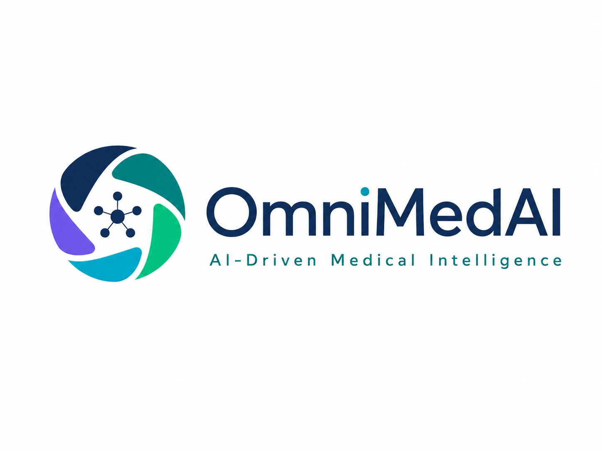
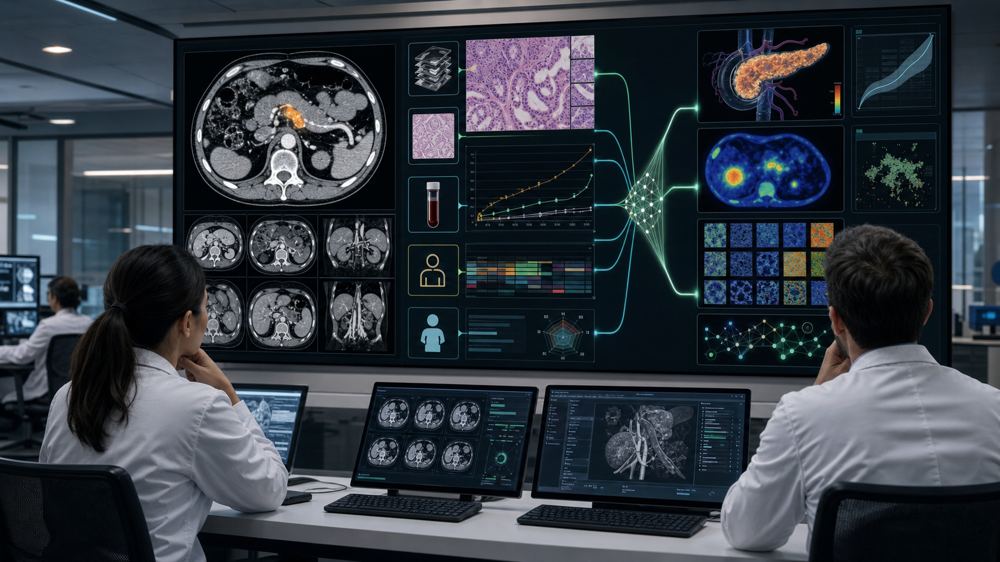
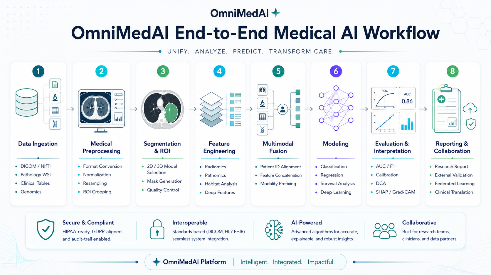
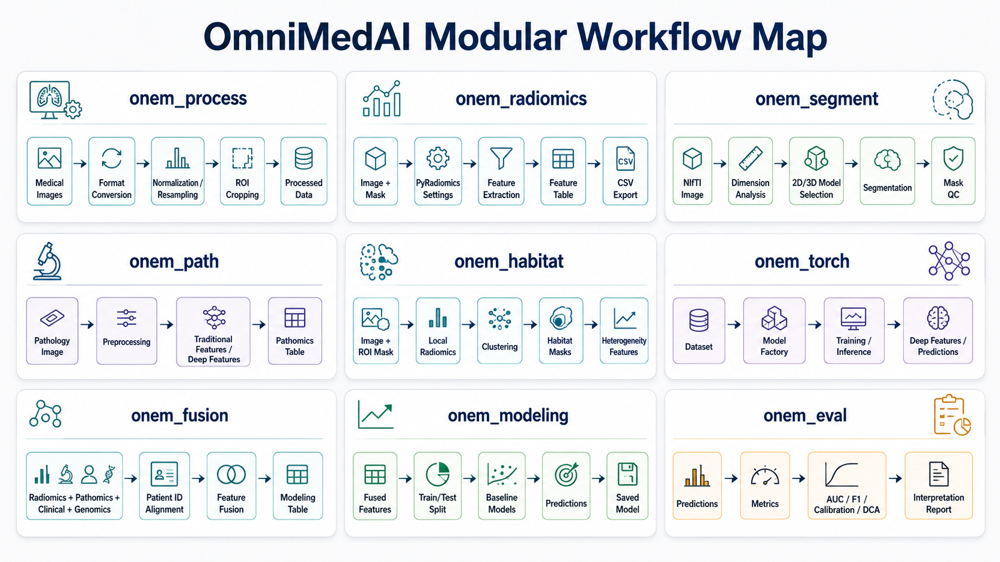

# OmniMedAI: Omni Medical AI Platform



OmniMedAI is a modular medical AI platform for heterogeneous biomedical data
analysis. It helps researchers and clinical AI teams build reproducible
workflows across medical imaging, radiomics, pathology, habitat analysis,
multimodal fusion, model training, evaluation, and reporting.

The repository currently provides a Python SDK-style platform foundation. Some
advanced capabilities described in the roadmap, such as federated learning,
large-scale clinical deployment, genomic pipelines, and full model governance,
are planned or integration-level features rather than complete out-of-the-box
modules.



## Platform Scope

OmniMedAI is designed around the following end-to-end workflow:

```text
Data ingestion
  -> Medical preprocessing
  -> Segmentation / ROI preparation
  -> Feature engineering
  -> Multimodal fusion
  -> Modeling
  -> Evaluation and interpretation
  -> Reporting and collaboration
```

## Workflow Diagrams

Recommended image filenames:

- `docs/assets/omnimedai-platform-workflow.png`: overall platform workflow.
- `docs/assets/omnimedai-module-workflow-map.png`: module-level workflow map.





## Current Modules

| Capability | Module | Status |
|---|---|---|
| Medical image preprocessing, DICOM/NIfTI conversion, ROI cropping | `onem_process` | Available |
| Interpolation and pluggable deep-model super-resolution reconstruction | `onem_process.reconstruction` | Available |
| Radiomics feature extraction from images and masks | `onem_radiomics` | Available |
| Automatic ROI segmentation framework with 2D/3D model selection | `onem_segment` | Framework available; pretrained weights required for real inference |
| Digital pathology feature extraction | `onem_path` | Available baseline; optional CellProfiler/TITAN dependencies |
| Bulk/scRNA-seq QC, cell composition, and accession validation | `onem_omics` | Available analysis utilities |
| Habitat and intratumoral heterogeneity analysis | `onem_habitat` | Available baseline |
| Deep-learning model components | `onem_torch` | Available baseline |
| Multimodal feature fusion | `onem_fusion` | Newly added baseline |
| Feature-table modeling | `onem_modeling` | Newly added baseline |
| Model evaluation and reporting metrics | `onem_eval` | Newly added baseline |
| Notebook tutorials and example workflows | `onem_start` | Available |

## Core Capabilities

### 1. Data Ingestion and Preprocessing

- Import and convert medical imaging data such as DICOM and NIfTI.
- Normalize intensity values with Z-score, min-max, percentile, and windowing workflows.
- Resample, crop, pad, and extract ROI volumes.
- Batch-convert image/mask datasets for downstream modeling.
- Reconstruct arrays or NIfTI volumes with interpolation baselines or
  user-supplied PyTorch models while recording parameters and provenance.

Primary module: `onem_process`

### 2. Segmentation and ROI Preparation

- Analyze image dimensionality and slice characteristics.
- Choose 2D or 3D segmentation workflows based on image structure.
- Manage model loading, inference, post-processing, and NIfTI mask export.
- Validate external manual masks and quantify Dice, Jaccard, HD95, and volume agreement.

Primary module: `onem_segment`

Note: this module provides the segmentation framework. Real segmentation
requires compatible model definitions and pretrained weights.

### 3. Feature Engineering

- Extract radiomics features with PyRadiomics, including first-order, texture,
  and shape features.
- Enable Original, Wavelet, LoG, and other PyRadiomics image filters through
  serializable configuration.
- Extract pathology features from histology images with traditional image
  features and deep feature interfaces.
- Compute local radiomics features and perform habitat clustering for
  intratumoral heterogeneity analysis.
- Use deep model components from `onem_torch` for classification or feature
  extraction research.

Primary modules: `onem_radiomics`, `onem_path`, `onem_habitat`, `onem_torch`

### 4. Multimodal Fusion

- Align feature tables by patient or sample ID.
- Combine radiomics, pathomics, clinical, genomic, habitat, and deep features.
- Add modality prefixes to prevent feature-name collisions.
- Create modeling-ready fused feature tables.

Primary module: `onem_fusion`

### 5. Modeling

- Train baseline tabular models from extracted or fused features.
- Support common classification and regression workflows, including optional XGBoost.
- Compose univariate filtering, correlation removal, mRMR, and LASSO inside
  leakage-safe nested validation.
- Save fitted models, infer independent external cohorts, and generate optional
  SHAP feature summaries.
- Provide a clean starting point for radiomics, clinical, and multimodal
  predictive modeling.

Primary module: `onem_modeling`

### 6. Evaluation and Interpretation

- Compute accuracy, F1-score, recall, precision, confusion matrix, and AUC.
- Evaluate regression models with MAE, MSE, and R2.
- Prepare outputs for reports and external validation summaries.

Primary module: `onem_eval`

Advanced evaluation includes bootstrap AUC confidence intervals, calibration
tables, decision-curve analysis, and machine-readable workflow manifests.
Planned extensions include Grad-CAM hooks and clinical report generation.

### Modular Research Design

OmniMedAI provides reusable algorithms and validation components. Cohort
assembly, endpoints, study-specific thresholds, final feature sets, and figure
organization remain the responsibility of each research project.

## Installation

OmniMedAI is packaged through `pyproject.toml`. Install only the capability
groups required by your study.

### Minimal

```bash
pip install -e .
```

### Medical Imaging

```bash
pip install -e ".[imaging]"
```

### Radiomics

```bash
pip install -e ".[radiomics]"
```

### Pathology

```bash
pip install Pillow scikit-image matplotlib
# Optional for full CellProfiler workflows:
pip install cellprofiler
```

### Deep Learning

```bash
pip install -e ".[deep]"
```

### Complete Analysis Environment

```bash
pip install -e ".[analysis]"
```

## Quick Start

### Radiomics Feature Extraction

```python
from onem_radiomics import RadiomicsExtractor, PRESET_CONFIGS

extractor = RadiomicsExtractor(PRESET_CONFIGS["ct_lung"])
result = extractor.extract_features(
    image_path="data/images/patient001.nii.gz",
    mask_path="data/masks/patient001_mask.nii.gz",
    patient_id="patient001"
)

print(len(result["features"]))
```

### Multimodal Fusion

```python
from onem_fusion import FeatureFusion, FusionConfig

fusion = FeatureFusion(FusionConfig(
    id_column="patient_id",
    join_strategy="inner",
    modality_prefixes={
        "radiomics": "rad",
        "clinical": "clin",
        "pathology": "path"
    }
))

fused = fusion.fit_transform({
    "radiomics": "output/radiomics_features.csv",
    "clinical": "data/clinical.csv",
    "pathology": "output/pathology_features.csv"
})

fusion.save(fused, "output/fused_features.csv")
```

### Modeling and Evaluation

```python
from onem_modeling import ModelingConfig, train_tabular_model
from onem_eval import EvaluationConfig, ModelEvaluator

result = train_tabular_model(
    csv_path="output/fused_features.csv",
    label_column="label",
    config=ModelingConfig(task="classification", model_type="random_forest")
)

metrics = ModelEvaluator(EvaluationConfig(task="classification")).evaluate(
    y_true=result["y_test"],
    y_pred=result["predictions"],
    y_proba=result["probabilities"]
)

print(metrics["accuracy"])
```

### Advanced Validation

Advanced validation utilities include patient-level splitting, leakage checks,
ICC, bootstrap confidence intervals, calibration, decision-curve analysis,
survival analysis, treatment-effect sensitivity analysis, and
machine-readable workflow manifests.

See [`docs/actual_data_workflow.md`](./docs/actual_data_workflow.md) for
advanced study validation examples and input schemas.

### Super-Resolution Reconstruction

```python
from onem_process import InterpolationReconstructor, ReconstructionConfig

reconstructor = InterpolationReconstructor(
    ReconstructionConfig(
        scale_factors=(2.0, 2.0, 1.0),
        interpolation="cubic",
    )
)
result = reconstructor.reconstruct_nifti(
    "data/input.nii.gz",
    "output/sr_input.nii.gz",
)
print(result.metadata)
```

## Notebooks

The `onem_start` folder contains guided notebooks:

- `00_Quick_Start_Tutorial.ipynb`: first platform walkthrough.
- `01_Radiomics_Feature_Extraction.ipynb`: radiomics feature extraction.
- `02_ROI_Segmentation.ipynb`: ROI segmentation workflow.
- `03_Pathology_Analysis.ipynb`: pathology feature extraction.
- `04_Comprehensive_Workflow.ipynb`: end-to-end multimodal workflow.

For configuration-driven advanced study validation, use:

```bash
python -m onem_start.revision_analysis docs/templates/revision_workflow_config.json
```

## Roadmap

### Near Term

- Add lightweight test datasets and reproducible demo commands.
- Expand publication-ready report exporters and visualization helpers.

### Platform Extensions

- Clinical table processing and data dictionary validation.
- Genomic and molecular feature ingestion.
- Survival analysis, Cox models, and time-to-event validation.
- Advanced multimodal fusion: early fusion, late fusion, MIL, attention fusion.
- Experiment tracking and model versioning.
- Federated learning and privacy-preserving multi-center training.
- Automated clinical report generation.

## Clinical and Research Notes

OmniMedAI is intended for research and translational development. Clinical use
requires local validation, regulatory review, privacy governance, and
institution-specific quality control.

Recommended practices:

- Use de-identified data.
- Keep train, validation, internal test, and external test cohorts separated.
- Record preprocessing settings and feature extraction parameters.
- Validate models across scanners, institutions, and patient subgroups.
- Report calibration, decision-curve utility, and confidence intervals when
  targeting clinical decision support.

## Development Consortium

OmniMedAI is a collaborative effort involving research and clinical partners
focused on multimodal medical data analysis, precision medicine, imaging
biomarkers, pathology AI, and privacy-preserving learning.

### Core Development and Clinical Translation

- Fudan University, China: multimodal data fusion and computational pathology.
- Zhongshan Hospital, Fudan University, China: clinical research design,
  cohort validation, and translational evaluation.
- Bengbu Medical College, China: medical AI workflow development and education.
- The First Affiliated Hospital of Bengbu Medical College, China: clinical
  scenario validation and dataset curation.
- Southeast University, China: medical image analysis and AI algorithm
  optimization.
- Zhejiang Provincial People's Hospital, China: oncology dataset curation and
  clinical validation.
- Xijing Hospital, China: advanced imaging biomarker research.
- Shanghai Jiao Tong University, China: deep-learning model development.
- Harbin Institute of Technology, China: privacy-preserving and federated
  learning research.
- North University of China, China: signal processing and hardware integration.
- Shanxi University, China: genomic and bioinformatics analysis.
- Anhui Science and Technology University, China: edge-computing and applied
  AI workflows.
- CETC 41st Research Institute, China: precision medical device research and
  development.
- Jiangsu Provincial People's Hospital, China: clinical data validation and
  chronic disease research.
- Xidian University, China: communication technologies and embedded systems
  integration.
- Tongji Hospital, Wuhan, China: large-scale clinical cohort studies and
  therapeutic evaluation.

### International Partners

- University College Dublin, Ireland: radiogenomics and translational research.
- University of Adelaide, Australia: interpretable AI and clinical decision
  support.

### Collaboration Focus

- Interdisciplinary development across clinical medicine, medical imaging,
  pathology, engineering, and bioinformatics.
- Multi-center validation across institutional cohorts.
- Translation from research prototypes to regulated clinical AI workflows.

## Key References

The following publications and research directions informed the platform
architecture, use cases, and roadmap.

### Radiomics and Deep Learning

1. Chen et al. (2022). MRI radiomics for mucosal healing prediction in Crohn's
   disease. *Journal of Gastroenterology*.
2. Shen et al. (2025). Correlation of MRI characteristics with KRAS mutation
   status in pancreatic ductal adenocarcinoma. *Abdominal Radiology (NY)*.
3. Shen et al. (2025). Contrast-enhanced MRI-based intratumoral heterogeneity
   assessment for predicting lymph node metastasis in pancreatic ductal
   adenocarcinoma. *Insights into Imaging*.
4. Li et al. (2024). SMAD4-mutated pancreatic ductal adenocarcinoma
   identification using preoperative MRI and clinical data. *BMC Medical
   Imaging*.
5. Li et al. (2024). Preoperative prediction of vasculogenic mimicry in lung
   adenocarcinoma using CT radiomics. *Clinical Radiology*.

### Pathomics and Whole-Slide Imaging

1. Liu et al. (2020). Automated glioma subtyping via MRI radiomics.
   *Neuro-Oncology*.
2. Yang et al. (2020). Preoperative cervical cancer radiomics.
   *European Radiology*.

### Technical Directions

1. Liu et al. (2024). Deep learning-reconstructed ultra-fast
   respiratory-triggered T2-weighted liver MRI. *Magnetic Resonance Imaging*.
2. Huang et al. (2021). Federated learning for privacy-preserving medical AI.
   *Gut*.
3. Zhang et al. (2022). Multi-instance learning for robust diagnostic modeling.
   *IEEE Journal of Biomedical and Health Informatics*.
4. Guo et al. (2021). MRI radiomics and VAE latent-space analysis for HCC immune
   subtyping.

Note: references are retained from the original project description and should
be verified against the final manuscript or product documentation before formal
citation.

## Contact

For professional or collaboration inquiries, please contact:

- Email: <acezqy@gmail.com>

For access to additional features and to try the premium version, please
contact our development team at <onemai@foxmail.com>.
