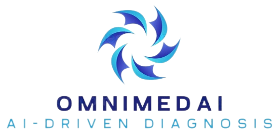

# OmniMedAI: Omni Medical AI Platform

## Abstract

OmniMedAI is an advanced AI-driven platform designed to integrate and analyze heterogeneous medical data, including radiological imaging, digital pathology, genomics, and clinical records. Leveraging cutting-edge techniques in radiomics, deep learning, habitat analysis, and multi-instance learning, the platform enables researchers and clinicians to build robust predictive models for disease diagnosis, prognosis, and personalized treatment planning.  

## System Architecture  

> OmniMedAI adopts a modular architecture to support end-to-end multimodal data analysis:  

{ width="800" height="600" style="display: block; margin: 0 auto" }

1. **Data Integration Module**  
   • Supports import of DICOM, CSV, HDF5, and other formats.  

   • Integrates tools like ITK-SNAP (for ROI segmentation in radiology) and 3D Slicer (for 3D visualization).  

2. **Preprocessing Engine**  
   • Normalization: Z-score scaling and min-max normalization to [-1, 1].  

   • Data Augmentation: Random cropping, horizontal/vertical flipping (training-only).  

   • Whole-Slide Image (WSI) Processing: QuPath (annotation) + CellProfiler (feature extraction) for histopathology.  

3. **Feature Engineering**  
   • Radiomics: Extracts 1,500+ features (shape, texture, intensity) using Pyradiomics (e.g., Laplacian of Gaussian (LoG) filtering, wavelet transforms).  

   • Deep Learning: Models like UNet (segmentation), Swin Transformer (feature extraction), and transfer learning with ResNet/DenseNet.  

   • Pathomics: Grad-CAM visualization + TF-IDF weighted bag-of-words (BoW) for WSI analysis.  

4. **Model Training & Evaluation**  
   • Algorithms: COX regression, SVM, XGBoost, LightGBM.  

   • Metrics: AUC, F1-score, calibration curves, decision curve analysis (DCA).  

   • Federated Learning: Secure, decentralized training across institutions.  

## Technical Highlights  

1. Multi-Instance Learning (MIL) Fusion  
    • Probability Histogram (PLH): Generates slice-level prediction distributions.  

    • BoW with TF-IDF: Encodes slice-level features into a global signature.  

    • Early Fusion: Concatenates PLH and BoW features:  

    $$
    \text{feature}_{fusion} = Histo_{prob} \oplus Histo_{pred} \oplus Bow_{prob} \oplus Bow_{pred}
    $$

2. Survival Analysis & Imbalanced Data Handling  
    • KM Survival Curves: Log-rank test for group comparison:  

    $$
    \hat{S}(t) = \prod_{t_i \leq t} \left(1 - \frac{d_i}{n_i}\right)
    $$
    • SMOTE Oversampling: Balances classes during training.  

3. Model Interpretability  
    • Grad-CAM: Visualizes attention maps for radiology/WSI models.  

    • SHAP Values: Quantifies feature importance (e.g., gene mutations).  

## Applications & Case Studies

1. **Oncology**
    • ​**​Pancreatic Ductal Adenocarcinoma (PDAC):**​
   - Predicts KRAS mutation status using MRI-based intratumoral heterogeneity features (e.g., texture complexity, kinetic parameters) (**Shen et al., \*Abdom Radiol (NY)\*, 2025**).
   - Assesses lymph node metastasis risk via contrast-enhanced MRI habitat analysis (**Shen et al., \*Insights Imaging\*, 2025**).
   - Identifies SMAD4 mutations by integrating preoperative MRI radiomics and clinical variables (**Li et al., \*BMC Med Imaging\*, 2024**).
      • ​**​Lung Adenocarcinoma:**​
   - Preoperative prediction of vasculogenic mimicry using CT radiomics (**Li et al., \*Clin Radiol\*, 2024**).
2. **Liver Imaging**
    • Accelerates MRI acquisition with deep learning-reconstructed ultra-fast respiratory-triggered T2-weighted imaging (scan time reduced to 30s) (​**​Liu et al., \*Magn Reson Imaging\*, 2024​**​).
3. **Immunotherapy Response**
    • HCC Immune Subtyping: MRI radiomics + VAE latent space analysis (Guo et al., 2021).
4. **Cardiovascular Risk**
    • Coronary Plaque Classification: CCTA-based deep learning (Huang et al., 2020).

------

## Key References

### **Radiomics & Deep Learning**

1. **Chen et al. (2022).** *J Gastroenterology*. MRI radiomics for mucosal healing prediction in Crohn’s disease.
2. **Shen et al. (2025).** *Abdom Radiol (NY)*. Correlation of MRI characteristics with KRAS mutation status in pancreatic ductal adenocarcinoma.
3. **Shen et al. (2025).** *Insights Imaging*. Contrast-enhanced MRI-based intratumoral heterogeneity assessment for predicting lymph node metastasis in PDAC.
4. **Li et al. (2024).** *BMC Med Imaging*. SMAD4-mutated PDAC identification using preoperative MRI and clinical data.

### **Pathomics & WSI**

1. **Liu et al. (2020).** *Neuro-Oncology*. Automated glioma subtyping via MRI radiomics.
2. **Yang et al. (2020).** *Eur Radiology*. Preoperative cervical cancer radiomics.

### **Technical Innovations**

1. **Liu et al. (2024).** *Magn Reson Imaging*. Deep learning-reconstructed liver MRI.
2. **Huang et al. (2021).** *Gut*. Federated learning for privacy-preserving AI.
3. **Zhang et al. (2022).** *IEEE JBHI*. Multi-instance learning for diagnostic robustness.

------

## Summary

OmniMedAI bridges the gap between heterogeneous medical data and actionable insights. Its modular design and validated workflows position it as a cornerstone for translational research in precision medicine. Future updates will expand support for emerging modalities (e.g., liquid biopsy) and multimodal fusion techniques.

## **OmniMedAI Development Consortium**

**OmniMedAI** is a collaborative effort developed by the following institutions and research experts:

### **Core Development Leaders**  & **Collaborating Institutions**

- **Fudan University** (China) – Multimodal data fusion and computational pathology
- **Zhongshan Hospital, Fudan University** (China) – Clinical trial design and validation
- **Bengbu Medical College** (China)
- **The First Affiliated Hospital of Bengbu Medical College** (China)
- **Southeast University** (China) – Medical imaging analysis and AI algorithm optimization
- **Zhejiang Provincial People’s Hospital** (China) – Oncology dataset curation
- **Xijing Hospital** (China) – Advanced imaging biomarker research
- **Shanghai Jiao Tong University** (China) – Deep learning model development
- **Harbin Institute of Technology** (China) – Privacy-preserving federated learning
- **North University of China** (China) – Signal processing and hardware integration
- **Shanxi University** (China) – Genomic data analysis
- **Anhui Science and Technology University** (China) – Edge computing solutions
- **CETC 41st Research Institute** (China) – Precision medical device R&D
- **Jiangsu Provincial People's Hospital** (China) – Clinical data validation and chronic disease research
- **Xidian University** (China) – Communication technologies and embedded systems integration
- **Tongji Hospital, Wuhan** (China) – Large-scale clinical cohort studies and therapeutic evaluation

#### **International Partners**

- **University College Dublin** (Ireland) – Radiogenomics and translational research
- **University of Adelaide** (Australia) – Interpretable AI and clinical decision support

### **Key Collaboration Features**

- **Interdisciplinary Expertise**: Combines clinical medicine (Zhongshan Hospital, Tongji Hospital), engineering (Xidian University, HIT), and bioinformatics (Fudan University).
- **Global Validation**: Multicenter datasets spanning Chinese (Xijing Hospital, Jiangsu Provincial People's Hospital), European (UCD), and Australian (Adelaide) cohorts.
- **Technology Transfer**: Direct pathway from academic research to FDA/CE-certified clinical tools (CETC 41st Research Institute).
